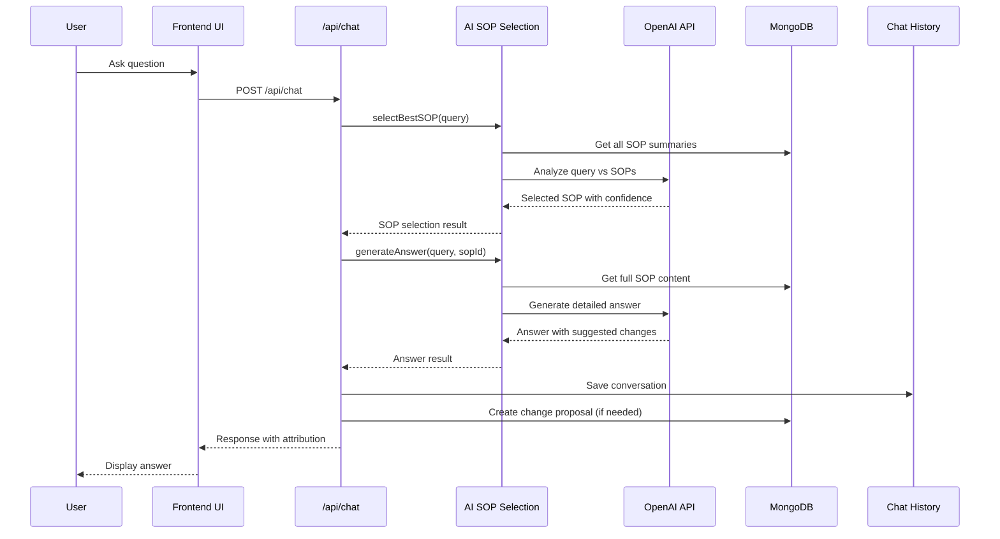
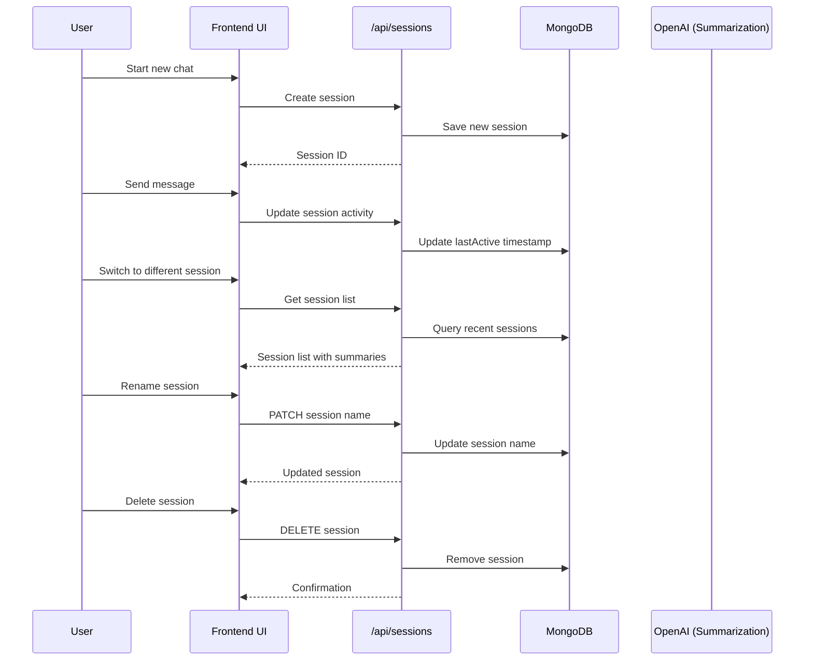
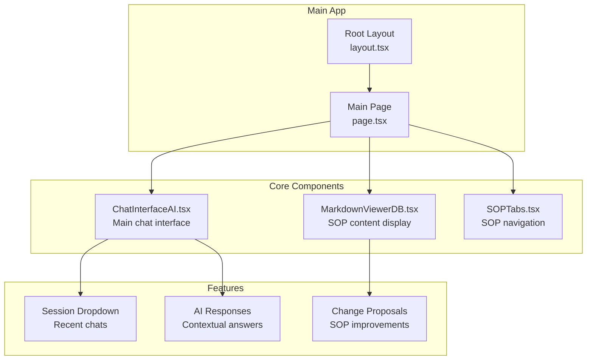
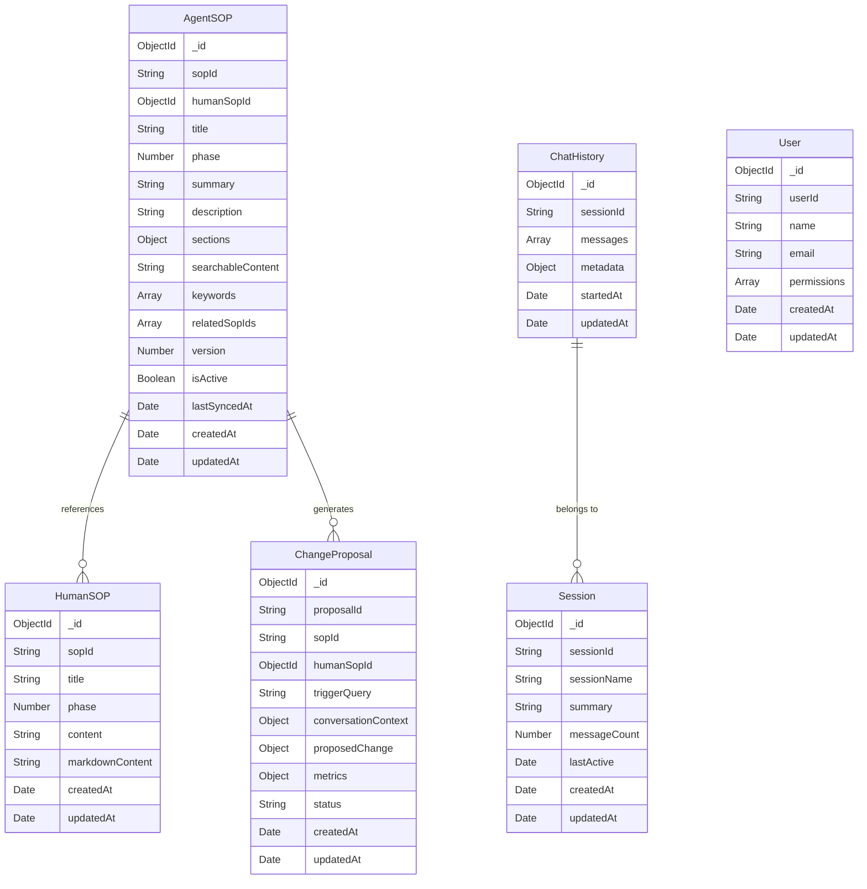
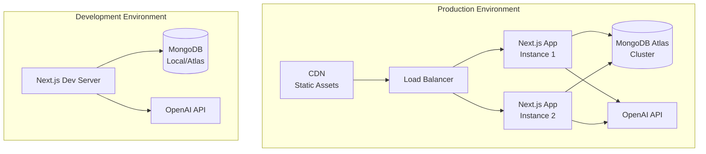

# PMO Playbook - System Architecture

## Overview
The PMO Playbook is an AI-powered Project Management Office (PMO) Standard Operating Procedure (SOP) management system built with Next.js, MongoDB, and OpenAI integration.

## High-Level Architecture

```mermaid
graph TB
    subgraph "Client Layer"
        UI[Next.js Frontend<br/>React Components]
        Chat[Chat Interface<br/>AI.tsx]
        Viewer[Markdown Viewer<br/>DB.tsx]
        Tabs[SOP Tabs<br/>Component]
    end

    subgraph "API Layer (Next.js App Router)"
        ChatAPI[/api/chat<br/>POST]
        HistoryAPI[/api/chat-history<br/>GET]
        SessionsAPI[/api/sessions<br/>GET/PATCH/DELETE]
        ProposalsAPI[/api/proposals<br/>GET/POST]
        ContentAPI[/api/content-db<br/>GET]
        FilesAPI[/api/files-db<br/>GET]
    end

    subgraph "Business Logic Layer"
        AISelector[AI SOP Selection<br/>ai-sop-selection.ts]
        DBConnector[MongoDB Connection<br/>mongodb.ts]
    end

    subgraph "Data Layer"
        MongoDB[(MongoDB Atlas<br/>Database)]
        
        subgraph "Collections"
            AgentSOPs[agent_sops<br/>Collection]
            HumanSOPs[human_sops<br/>Collection]
            ChatHistory[chat_history<br/>Collection]
            Sessions[sessions<br/>Collection]
            Proposals[change_proposals<br/>Collection]
            Users[users<br/>Collection]
        end
    end

    subgraph "External Services"
        OpenAI[OpenAI API<br/>GPT-4o]
        YAML[YAML Content<br/>Files]
    end

    UI --> ChatAPI
    UI --> HistoryAPI
    UI --> SessionsAPI
    UI --> ProposalsAPI
    UI --> ContentAPI
    UI --> FilesAPI

    ChatAPI --> AISelector
    AISelector --> OpenAI
    AISelector --> DBConnector
    DBConnector --> MongoDB

    HistoryAPI --> DBConnector
    SessionsAPI --> DBConnector
    ProposalsAPI --> DBConnector
    ContentAPI --> DBConnector
    FilesAPI --> DBConnector

    YAML --> ContentAPI
```

## Data Flow Architecture

### 1. Chat Flow


### 2. Session Management Flow


## Component Architecture

### Frontend Components


## Database Schema

### Collections Overview


## Technology Stack

### Frontend
- **Framework**: Next.js 15.3.5 (App Router)
- **UI Library**: React 19.0.0
- **Styling**: Tailwind CSS 4.0.0-beta.14
- **Icons**: Lucide React
- **Markdown**: React Markdown + Remark GFM

### Backend
- **Runtime**: Node.js with TypeScript
- **API**: Next.js API Routes
- **Database**: MongoDB 6.11.0 with Mongoose 8.8.4
- **AI Integration**: OpenAI GPT-4o

### Development Tools
- **Language**: TypeScript 5
- **Linting**: ESLint 9
- **Package Manager**: npm
- **Build Tool**: Next.js built-in

## Key Features Architecture

### 1. AI-Powered SOP Selection
- **Input**: User query (natural language)
- **Process**: 
  1. Extract all SOP summaries from database
  2. Send to OpenAI for relevance analysis
  3. Return best matching SOP with confidence score
- **Output**: Selected SOP ID and reasoning

### 2. Contextual Answer Generation
- **Input**: User query + selected SOP + conversation history
- **Process**:
  1. Retrieve full SOP content
  2. Build conversation context (last 4 messages)
  3. Generate detailed response using OpenAI
  4. Analyze for potential SOP improvements
- **Output**: Detailed answer + suggested changes

### 3. Session Management
- **Features**:
  - Auto-save conversations
  - AI-generated session summaries
  - Session switching with history preservation
  - Session renaming and deletion
- **Storage**: MongoDB with timestamps and activity tracking

### 4. Change Proposal System
- **Trigger**: AI detects gaps in SOPs during conversations
- **Process**:
  1. Analyze user questions for improvement opportunities
  2. Create structured change proposals
  3. Track metrics (confidence, affected users)
  4. Prevent duplicate proposals
- **Storage**: Separate collection with full context

## Security & Performance

### Security Measures
- Environment variable configuration
- Input validation and sanitization
- MongoDB injection prevention via Mongoose
- API rate limiting (Next.js built-in)

### Performance Optimizations
- Database indexing on frequently queried fields
- Connection pooling for MongoDB
- Client-side caching of session data
- Efficient text search with MongoDB text indexes

### Scalability Considerations
- Stateless API design
- Database connection pooling
- Modular component architecture
- Separation of concerns (AI, DB, UI)

## Deployment Architecture



## Future Architecture Considerations

### Planned Enhancements
1. **Admin Dashboard**: User management and analytics
2. **Real-time Collaboration**: WebSocket integration
3. **Advanced Analytics**: Usage patterns and SOP effectiveness
4. **Multi-tenant Support**: Organization isolation
5. **API Rate Limiting**: Advanced throttling
6. **Caching Layer**: Redis for frequently accessed data

### Scalability Roadmap
1. **Microservices**: Split AI and chat services
2. **Event-Driven Architecture**: Kafka for async processing
3. **Container Orchestration**: Kubernetes deployment
4. **Multi-region**: Global distribution
5. **Advanced Monitoring**: APM and logging solutions 