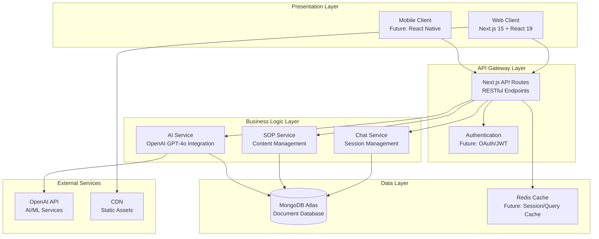
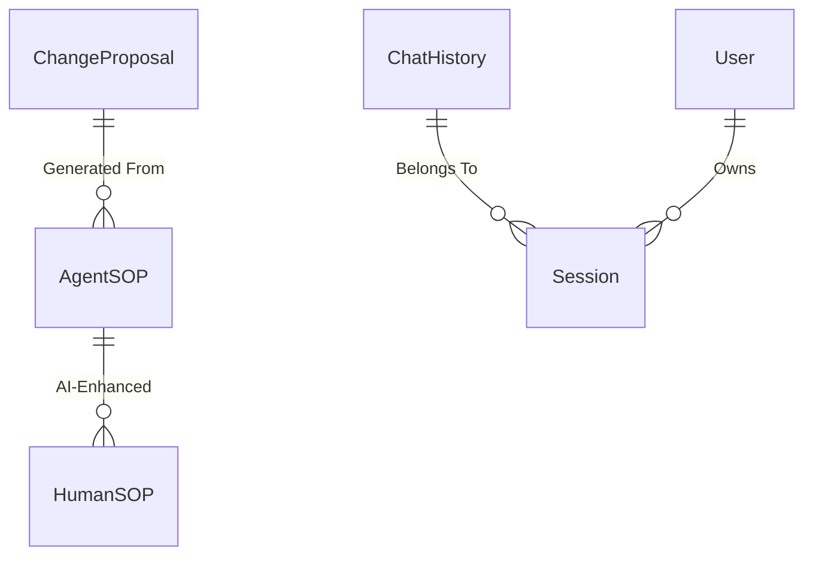
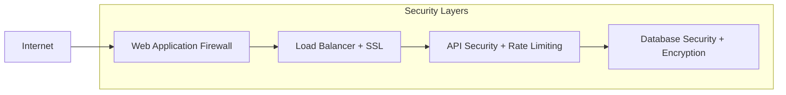

# PMO Playbook - Enterprise Architecture Overview

## System Architecture

## Key Design Decisions

### 1. Technology Stack
- **Frontend**: Next.js 15 (App Router) + React 19 + TypeScript
- **Backend**: Node.js + Next.js API Routes
- **Database**: MongoDB Atlas (Document Store)
- **AI**: OpenAI GPT-4o Integration
- **Deployment**: Vercel/Cloud Platform

### 2. Data Architecture

### 3. Scalability Considerations

| Component | Current | Future Scaling |
|-----------|---------|----------------|
| **API Layer** | Single Next.js Instance | Load Balancer + Multiple Instances |
| **Database** | MongoDB Atlas M0 | Sharded Cluster + Read Replicas |
| **AI Processing** | Direct OpenAI Calls | Queue System + Rate Limiting |
| **Caching** | None | Redis Cluster + CDN |
| **Monitoring** | Basic Logging | APM + Distributed Tracing |

## Enterprise Integration Points

### 1. Authentication & Authorization
- **Current**: Basic session management
- **Future**: SSO Integration (SAML/OAuth)
- **Enterprise**: Active Directory/LDAP Integration

### 2. Data Governance
- **Compliance**: GDPR, SOX, Industry Standards
- **Audit Trail**: Complete change tracking
- **Data Retention**: Configurable policies
- **Backup**: Automated MongoDB Atlas backups

### 3. Security Architecture

## Performance & Reliability

### Current Metrics
- **Response Time**: < 2s for AI responses
- **Availability**: 99.9% (MongoDB Atlas SLA)
- **Concurrent Users**: 100+ (estimated)
- **Data Volume**: ~1GB (estimated growth)

### Scaling Strategy
1. **Horizontal Scaling**: Multiple API instances
2. **Database Scaling**: MongoDB Atlas auto-scaling
3. **Caching Strategy**: Redis for frequent queries
4. **CDN**: Global content distribution

## Risk Assessment

| Risk Category | Impact | Mitigation |
|---------------|--------|------------|
| **AI Service Dependency** | High | Fallback responses, multiple AI providers |
| **Database Performance** | Medium | Indexing, caching, monitoring |
| **Security Vulnerabilities** | High | Regular audits, penetration testing |
| **Scalability Limits** | Medium | Architecture review, capacity planning |

## Cost Analysis

### Current Monthly Costs (Estimated)
- **MongoDB Atlas**: $57/month (M10 cluster)
- **OpenAI API**: $100-500/month (usage-based)
- **Hosting**: $20-100/month (Vercel/Cloud)
- **Total**: $177-657/month

### Enterprise Scaling Costs
- **High Availability**: +200% infrastructure
- **Advanced Security**: +50% compliance tools
- **Enterprise Support**: +100% vendor costs

## Migration & Deployment Strategy

### Phase 1: Current State
- ✅ Core functionality implemented
- ✅ Basic security measures
- ✅ MongoDB integration

### Phase 2: Enterprise Readiness
- 🔄 Authentication system upgrade
- 🔄 Advanced monitoring & logging
- 🔄 Performance optimization

### Phase 3: Scale & Integrate
- 📋 Multi-tenant architecture
- 📋 Enterprise SSO integration
- 📋 Advanced analytics dashboard

## Recommendations for Enterprise Architect

### 1. Immediate Actions
- **Security Review**: Penetration testing and vulnerability assessment
- **Performance Testing**: Load testing with expected user volume
- **Compliance Audit**: GDPR, SOX, industry-specific requirements

### 2. Architecture Improvements
- **Microservices Migration**: Split monolithic API into services
- **Event-Driven Architecture**: Implement message queues for async processing
- **Container Orchestration**: Kubernetes for better resource management

### 3. Integration Planning
- **Identity Management**: SSO integration with existing systems
- **Data Integration**: ETL pipelines for reporting and analytics
- **API Management**: Gateway for external integrations

### 4. Monitoring & Observability
- **Application Performance Monitoring**: New Relic, DataDog, or similar
- **Log Aggregation**: ELK stack or cloud-native solution
- **Alerting**: Proactive monitoring and incident response

## Success Metrics

| Metric | Target | Measurement |
|--------|--------|-------------|
| **User Adoption** | 80% of PMO staff | Usage analytics |
| **Response Time** | < 1.5s average | Performance monitoring |
| **System Uptime** | 99.95% | Availability monitoring |
| **User Satisfaction** | > 4.5/5 | Feedback surveys |
| **Cost per User** | < $50/month | Cost analysis | 