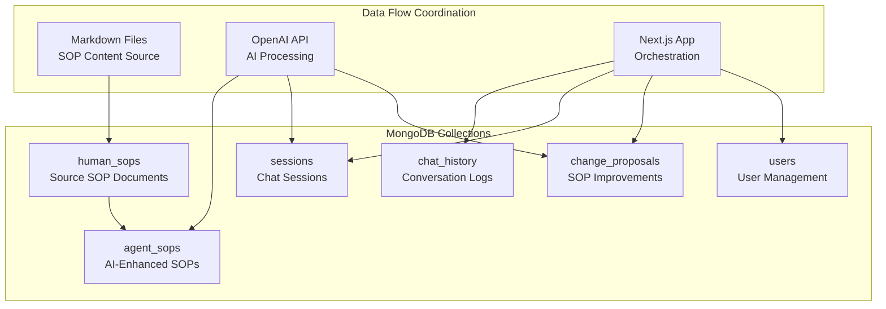
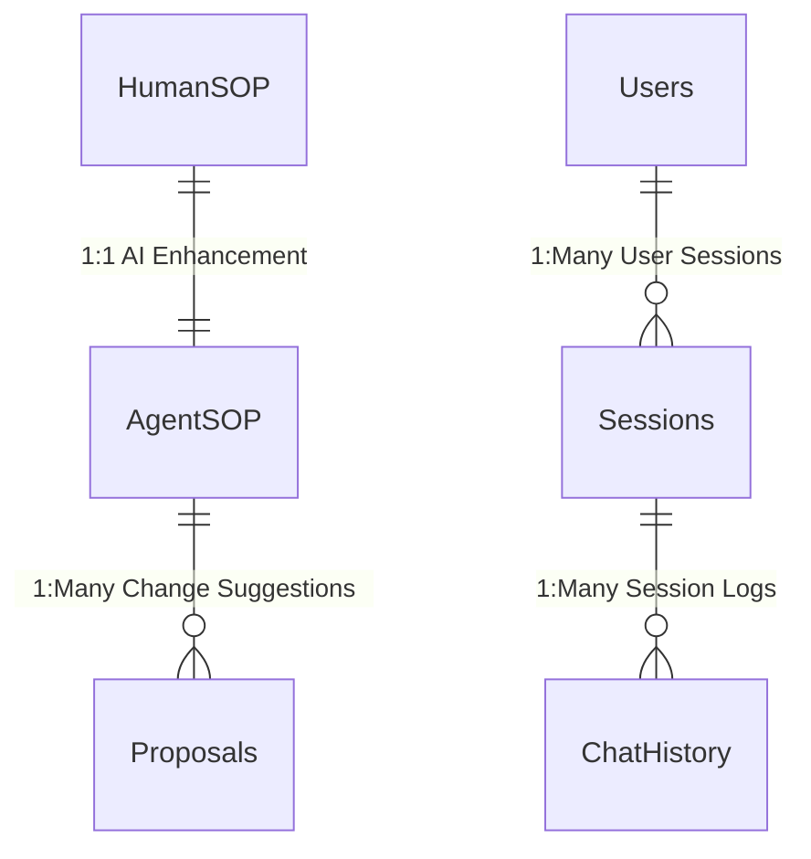

# PMO Playbook - MongoDB Data Architecture

## Database Collections & Data Flow



## Collection Details

| Collection | Purpose | Key Fields | Data Flow |
|------------|---------|------------|-----------|
| **human_sops** | Source SOP documents | `sopId`, `title`, `phase`, `content` | Markdown → HumanSOP → AgentSOP |
| **agent_sops** | AI-enhanced SOPs for chat | `sopId`, `summary`, `sections`, `searchableContent` | HumanSOP + AI → AgentSOP |
| **chat_history** | Complete conversation logs | `sessionId`, `messages[]`, `metadata` | App → ChatHistory |
| **sessions** | Chat session management | `sessionId`, `summary`, `lastActive` | App + AI → Sessions |
| **change_proposals** | SOP improvement suggestions | `sopId`, `proposedChange`, `metrics` | AI Analysis → Proposals |
| **users** | User management | `userId`, `permissions`, `preferences` | App → Users |

## Data Coordination Flow

### 1. SOP Processing Pipeline
```
Markdown Files → HumanSOP → AI Enhancement → AgentSOP
```
- **Markdown Files**: Raw SOP content in markdown format (01 Pre-Initiate.md, etc.)
- **HumanSOP**: Structured storage of original documents
- **AI Enhancement**: OpenAI processes content into chat-friendly format
- **AgentSOP**: Optimized for AI queries with searchable content

### 2. Chat Session Flow
```
User Query → AI Selection → Answer Generation → Session Update
```
- **User Query**: Sent to `/api/chat`
- **AI Selection**: Queries `agent_sops` for best match
- **Answer Generation**: Uses selected SOP + conversation history
- **Session Update**: Saves to `chat_history` + updates `sessions`

### 3. Change Proposal Generation
```
AI Analysis → Gap Detection → Proposal Creation → Metrics Tracking
```
- **AI Analysis**: Detects SOP gaps during conversations
- **Gap Detection**: Identifies missing or unclear content
- **Proposal Creation**: Stores in `change_proposals` collection
- **Metrics Tracking**: Tracks confidence, affected users, duplicates

## Key Data Relationships



## Data Handling Patterns

### 1. **Read-Heavy Operations**
- **AgentSOP**: Frequent queries for AI selection
- **Sessions**: Recent sessions list and switching
- **ChatHistory**: Loading conversation context

### 2. **Write-Heavy Operations**
- **ChatHistory**: Every message saved
- **Sessions**: Activity updates and summaries
- **Proposals**: New suggestions from AI analysis

### 3. **AI-Enhanced Operations**
- **AgentSOP**: AI-generated summaries and searchable content
- **Sessions**: AI-generated session summaries
- **Proposals**: AI-detected improvement opportunities

## Performance Optimizations

| Collection | Indexes | Caching Strategy |
|------------|---------|------------------|
| **agent_sops** | `sopId`, `phase`, `keywords`, `searchableContent` | Frequently accessed SOPs |
| **sessions** | `sessionId`, `lastActive` | Recent sessions list |
| **chat_history** | `sessionId`, `timestamp` | Session-specific queries |
| **proposals** | `sopId`, `status`, `createdAt` | Pending review proposals |

## Data Consistency Patterns

### 1. **Session Consistency**
- Auto-save before session switching
- Atomic updates for session metadata
- Fallback to new session on errors

### 2. **SOP Versioning**
- AgentSOP references HumanSOP by ObjectId
- Version tracking for content updates
- Last sync timestamp for synchronization

### 3. **Proposal Deduplication**
- 24-hour window for similar proposals
- Metrics aggregation for duplicate detection
- Status tracking for proposal lifecycle

## Error Handling & Recovery

| Scenario | Handling Strategy |
|----------|-------------------|
| **AI Service Down** | Fallback to basic SOP selection |
| **Database Connection Lost** | Retry with exponential backoff |
| **Session Save Failure** | Continue with in-memory session |
| **Proposal Creation Error** | Log error, continue conversation |

## Data Volume Estimates

| Collection | Current Size | Growth Rate | Retention Policy |
|------------|--------------|-------------|------------------|
| **human_sops** | ~50KB | Static | Permanent |
| **agent_sops** | ~100KB | Static | Permanent |
| **chat_history** | ~1MB | High | 90 days |
| **sessions** | ~10KB | Medium | 1 year |
| **proposals** | ~50KB | Low | 2 years |
| **users** | ~5KB | Low | Permanent | 