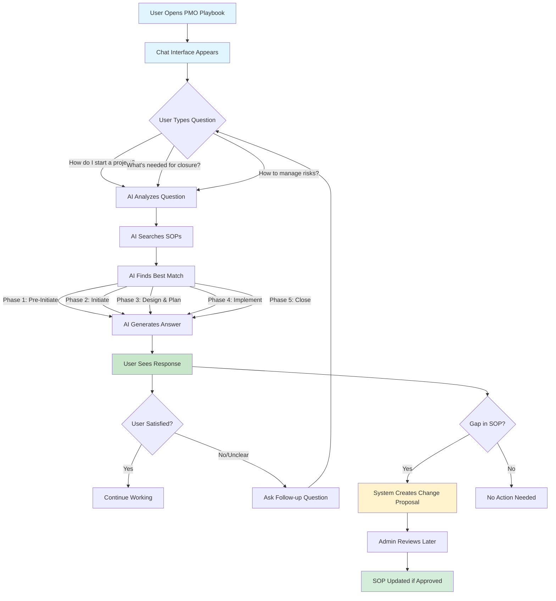

# PMO Playbook User Flow Diagram

## How the System Works for Users



## Simple Step-by-Step Process

### 1️⃣ **Ask a Question**
```
User: "How do I create a project charter?"
```

### 2️⃣ **AI Finds the Right Guide**
```
System: 🔍 Searching project management guides...
        ✅ Found: Initiation Phase guide
```

### 3️⃣ **Get Your Answer**
```
System: "To create a project charter, follow these steps:
        1. Define project objectives and scope
        2. Identify key stakeholders
        3. Outline deliverables and timeline
        4. Get sponsor approval
        
        📎 Templates available: Project Charter Template"
```

### 4️⃣ **System Learns & Improves**
- If the answer doesn't fully help, the system notes this
- Admins review gaps and update guides
- Future users get better answers

## Common User Scenarios

### 🆕 **Starting a New Project**
```
You Ask → "I have a new project idea. What do I do first?"
System → Guides you through Pre-Initiation phase
        → Provides business case template
        → Lists stakeholders to engage
```

### 📋 **During Project Execution**
```
You Ask → "How often should I report project status?"
System → Shows reporting requirements
        → Provides status report template
        → Explains escalation process
```

### 🏁 **Closing a Project**
```
You Ask → "My project is done. What's the closure process?"
System → Lists closure activities
        → Provides lessons learned template
        → Explains benefit tracking
```

## What Makes This Special?

### 🤖 **Smart Assistance**
- Understands your question context
- Finds the most relevant information
- Provides specific, actionable guidance

### 📚 **Always Current**
- Guides are updated based on user needs
- System learns from questions asked
- Content improves over time

### 🎯 **Tailored Responses**
- Answers match your project phase
- Includes relevant templates
- Shows only what you need

## No Technical Knowledge Required!

Just type your question like you're asking a colleague:
- ✅ "What documents do I need for kick-off?"
- ✅ "How do I handle scope changes?"
- ✅ "When should I escalate issues?"
- ✅ "What's a RAID log?"

The system understands natural language and provides clear, practical answers.

## For Visual Learners

### The User Journey

```
👤 You                    🤖 System                   📚 Result
│                         │                           │
├─ Type question ────────>├─ Understands intent      │
│                         ├─ Searches SOPs           │
│                         ├─ Selects best match      │
│<─ Receive answer ───────├─ Generates response      │
│                         │                           │
├─ Apply guidance ────────┼────────────────────────>├─ Project success!
│                         │                           │
└─ Ask more questions ───>└─ System gets smarter ───>└─ Better for everyone
```

## Benefits for Users

| Traditional Approach | PMO Playbook Approach |
|---------------------|----------------------|
| 📚 Search through long documents | 💬 Ask natural questions |
| 🔍 Guess which guide to use | 🎯 AI finds the right guide |
| 📖 Read entire sections | ✨ Get specific answers |
| ❓ Wonder if info is current | ✅ Always up-to-date |
| 🏃 Ask colleagues for help | 🤖 Instant 24/7 assistance |

## Getting Started is Easy

1. **Open the PMO Playbook** in your browser
2. **Type your question** in the chat box
3. **Get instant guidance** with templates and tools
4. **Follow the steps** provided
5. **Ask follow-ups** if needed

That's it! No training required. Just start asking questions about your project needs.